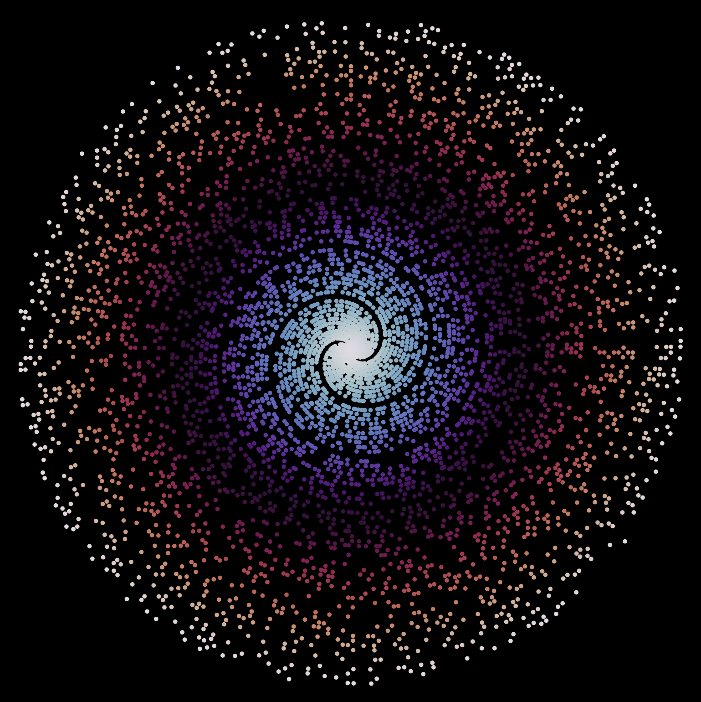

### Prime Number Visualizations

##### This directory contains a few different files that display prime numbers in various ways.

##### The first of these files is the twin_primes_graph.py file. It graphs the line formed by twin primes where they intersect the function |6x+1|. Twin primes are prime numbers that are separated by a single integer. For instance 3 and 5 or 17 and 19 are twin prime pairs, whereas 13 and 17 are not. Currently the graph formed by running this code displays the first 36 pairs of twin primes where x is 14000. 

Running this code to produce the graph is very simple. To run:
1) In the terminal run the command <code>python twin_primes_graph.py s b c f</code>
    - The s argument is the size, in inches, of the graph/image produced. The size is broken down into w and h, each provided as separate arguments.
        - The w argument is the width, in inches, of the graph/image produced.
        - The h argument is the height, in inches, of the graph/image produced.
    - The b argument is the background color of the graph/image.
    - The c argument is the colormap of the lines of the graph.
    - The f argument is optional. If supplied it saves the graph as a png with the given filename.

##### The following code will produce the image below:

    python twin_primes_graph.py 5 7 black twilight black_twilight.png

##### The second of these files is the polar_primes.py file. It graphs the primes (p,p) as polar coordinates. 

Running this code to produce the graph is very simple. To run:
1) In the terminal run the command <code>python polar_primes.py p s b c f</code>
    - The p argument is the max number that the list of primes will go up to.
    - The s argument is the size, in inches, of the graph/image produced. The size is broken down into w and h, each provided as separate arguments.
        - The w argument is the width, in inches, of the graph/image produced.
        - The h argument is the height, in inches, of the graph/image produced.
    - The b argument is the background color of the graph/image.
    - The c argument is the colormap of the lines of the graph.
    - The f argument is optional. If supplied it saves the graph as a png with the given filename.

##### The following code will produce the image below:

    python twin_primes_graph.py 50000 20 20 black twilight p_black_twilight.png

