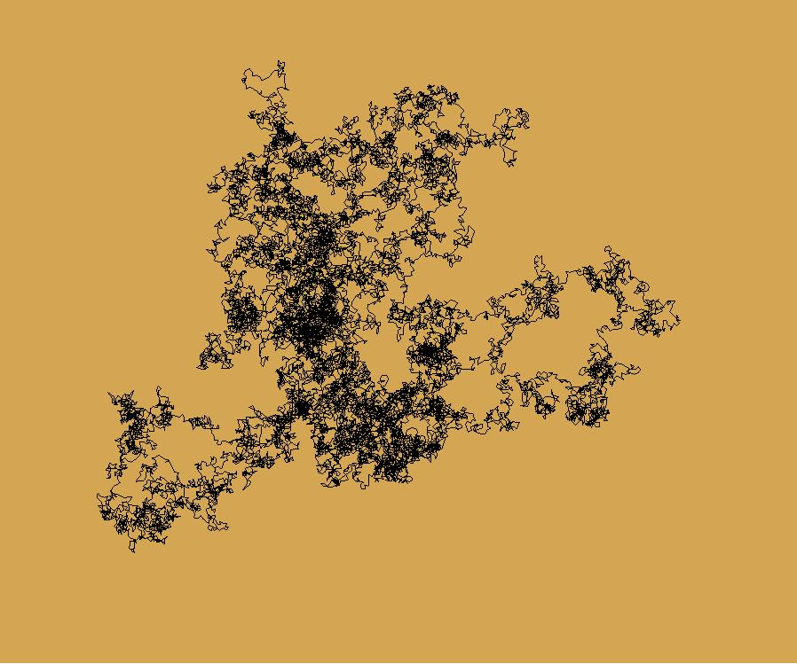

### Visualized Numbers 

##### The goal of this application is merely to visualize numbers in a fun way. Running the code is simple:
1) Import the code using <code>from draw_number import Number</code>
2) Create an instance of the number visualization code <code>n = Number(number)</code>. 
    - The number argument is the number that will be visualized.
3) Run the code <code>n.draw_number(bg, lc, length, size, starting_point, filename)</code>
    - The bg argument is the background color supplied to the turtle module.
    - The lc argument is the line color supplied to the turtle module.
    - The length argument is the length of the forward move of the pen.
    - The size argument is the size of the visualization.
    - The starting_point argument is where the visualization will start on the screen.
    - The filename argument is optional. If supplied it saves the file as a JPG with the given filename.

##### The following code will produce the image below representing Pi:

    from draw_number import Number
    from mpmath import mp
    mp.dps = 20000  # set number of digits
    number = mp.pi
    n = Number(number)

    bg = (212, 166, 83)
    lc = 'black'
    n.draw_number(bg, lc, 5, (1197, 997), (-200, 200), 'pi')

##### While this code will produce the image below representing E:

    from draw_number import Number
    from mpmath import mp
    mp.dps = 20000  # set number of digits
    number = mp.e
    n = Number(number)

    bg = (212, 166, 83)
    lc = 'black'
    n.draw_number(bg, lc, 5, (1197, 997), (-200, 200), 'e')

